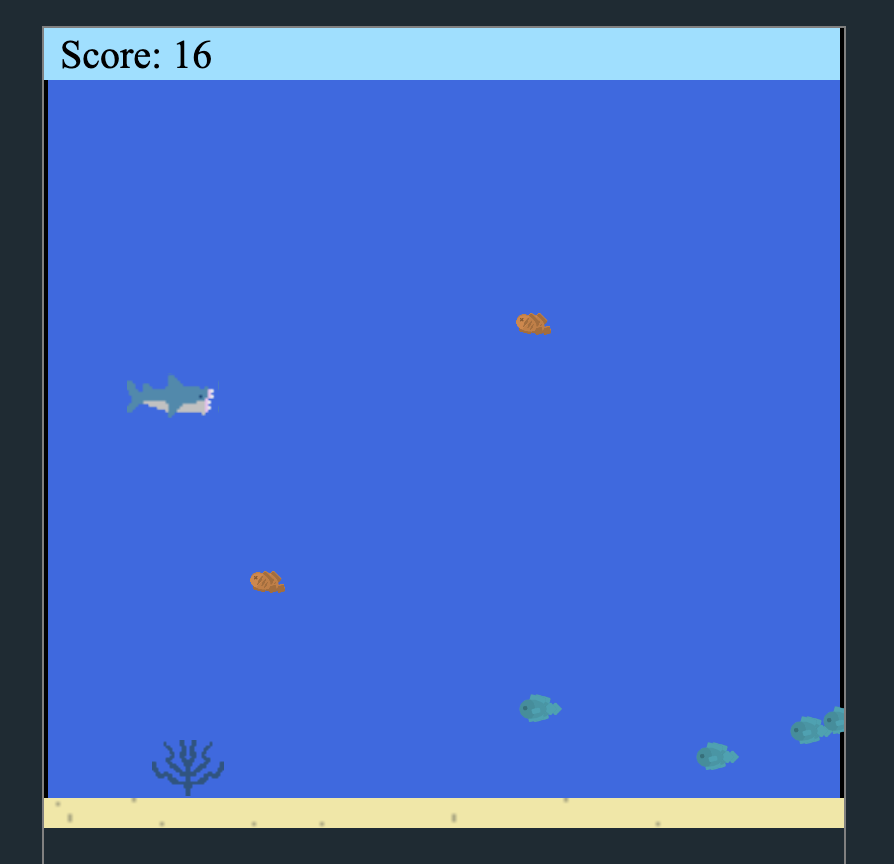

# Aquasaurious 🌊

Aquasaurious is the brain child of Matthew Moldovan and Gunnar Vittrup, two young highschool boys who took a more creative route to completing their assignment. What started as a boring and mundane project in a AP Computer Science Principals class quickly transformed into an alternate dimension of shark on its mission to evolve. 

## Premise 🐟

The premise of the game is quite simple. You are assuming the role of a hungry shark on a hunt to continue to eat and grow. However, as you continue to grow the threats you come accross will increase. Threats will not only become more abundant but larger and quicker as well. Continue to feast while overcoming challengers to become to monster of the depths.

## Design ⚓

The original design of Aquasaurious is a 2D endless scroller. Movement of the character sprite was limited to up, down, left, and right controlled by WASD or arrow keys. Various sprites will enter the scene from the right and continue to the left of the scene until they exit. Depending on the type of sprite, upon collision with the character sprite you will either gain points or be killed and reset.

## Tour of the game ⛴

1. Main Menu 🐙

2. Playing the game 🕹

3. Game Over ☠️

## Play it for yourself 🐡

For a playable version of our original version visit https://studio.code.org/projects/gamelab/7nAVVwul7Kmwn9_Iz2PssriDj8BymqSIz8kxDLni4HU

Aquasuarious is a collaborative effort between Matthew Moldovan and Gunnar Vittrup: 
- https://www.linkedin.com/in/matthewjmoldovan/
- https://www.linkedin.com/in/gvittrup/

